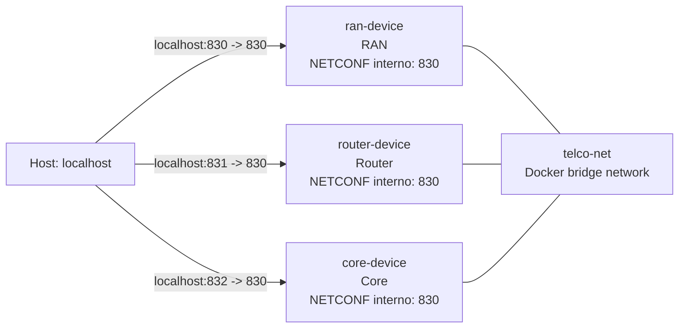
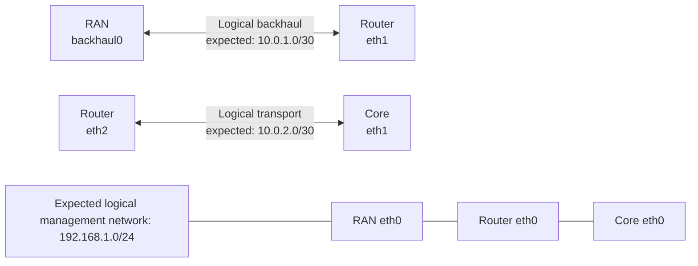

# Docker Compose Architecture

This document describes the environment defined in [docker-compose.yml](docker-compose.yml): three simulated network devices managed through NETCONF.

## Overview



All containers belong to the `telco-net` bridge network. On this network, containers can resolve and reach one another using their Docker DNS names: `ran-device`, `router-device`, and `core-device`.

## Device Image

All three services use the same image:

```text
ghcr.io/notconf/notconf:14265929521
```

The image starts a simulated NETCONF device. There are no Dockerfiles or local builds: at startup, Compose/Podman pulls the image from the GitHub Container Registry if it is not already available locally.

The service configuration differentiates the instances:

| Service/container | Role (`DEVICE_TYPE`) | Name (`DEVICE_NAME`) | Endpoint from the host |
| --- | --- | --- | --- |
| `ran-device` | `ran` | `ran-device` | `localhost:830` |
| `router-device` | `router` | `router-device` | `localhost:831` |
| `core-device` | `core` | `core-device` | `localhost:832` |

Inside every container, the NETCONF server always listens on port `830`. Ports `830`, `831`, and `832` on the host are different published mappings of that same internal port, allowing Python scripts, Ansible, and `netconf-console2` to connect to each device.

## Files Mounted in Containers

Each device receives two bind mounts under `/yang-modules`.

| Host path | Container path | Mode | Purpose |
| --- | --- | --- | --- |
| `./yang-models/common` | `/yang-modules` | read/write | Shared YANG modules: interfaces, IP types, routing, and their dependencies. |
| `./yang-models/<role>/startup` | `/yang-modules/startup` | read-only | Device-specific initial configuration. |

The first mount is `rw`: the container process can use or update the shared module content. The second mount is `ro`: it prevents the container from modifying the bootstrap XML file in the repository.

Because these mounts are bind mounts, no named Docker volumes are defined: the data consists of repository files and remains available on the host. Changing an XML file in the repository changes the file mounted on the next container startup; it does not automatically change the NETCONF datastore already running.

## Initial Configuration by Role

| Device | Bootstrap file | Relevant interfaces |
| --- | --- | --- |
| RAN | [yang-models/ran/startup/ran-config.xml](yang-models/ran/startup/ran-config.xml) | Management `eth0`, `backhaul0` towards Router, `radio0` |
| Router | [yang-models/router/startup/router-config.xml](yang-models/router/startup/router-config.xml) | Management `eth0`, `eth1` towards RAN, `eth2` towards Core |
| Core | [yang-models/core/startup/core-config.xml](yang-models/core/startup/core-config.xml) | Management `eth0`, `eth1` towards Router, external `eth2` |

Each XML file describes interfaces using the IETF models mounted from the common directory. These files populate the simulator's initial configuration; they do not directly configure the container's Linux network interfaces.

## Two Distinct Network Planes

### Docker Management and Transport Plane

`telco-net` is a Docker `bridge` network. It is the only Docker network declared by the Compose file and is used for host-to-container traffic and, when needed, container-to-container traffic. Docker assigns addresses on this network; the Compose file does not assign static IP addresses to containers.

The management path normally used by the repository tools is:

```text
client on the host -> localhost:<published port> -> container:830 -> NETCONF server
```

The Ansible inventory therefore uses `localhost:830`, `localhost:831`, and `localhost:832` for RAN, Router, and Core.

### Logical Network Plane of the Lab

The `eth0`, `backhaul0`, `eth1`, and `eth2` interfaces in the XML files are YANG configuration data managed through NETCONF. They represent the telco topology that the exercises automate:



These links do not create virtual cables, additional Docker subnets, or Linux routing between containers. The simulator stores and returns NETCONF state; endpoint consistency is checked on the client side by [network_check.py](network_check.py). The checker expects:

| Logical link | Endpoints | Expected network |
| --- | --- | --- |
| RAN-Router backhaul | `RAN:backhaul0` - `Router:eth1` | `10.0.1.0/30` |
| Router-Core | `Router:eth2` - `Core:eth1` | `10.0.2.0/30` |
| Management | all `eth0` interfaces | `192.168.1.0/24` |

The values in the startup files are the exercise's starting point and can differ from these expected networks. The Python and Ansible procedures update NETCONF datastores to the required values.

## Startup and Verification

Start with Docker Compose:

```bash
docker compose up -d
```

Or, in the Podman environment documented by the repository:

```bash
sudo podman-compose up -d
```

Check the containers and published ports:

```bash
docker compose ps
docker compose config
```

A NETCONF verification of the RAN from the host uses published port `830`:

```bash
netconf-console2 --host localhost --port 830 --user admin --password admin --db running --get-config
```

For Router and Core, replace the port with `831` and `832`, respectively.